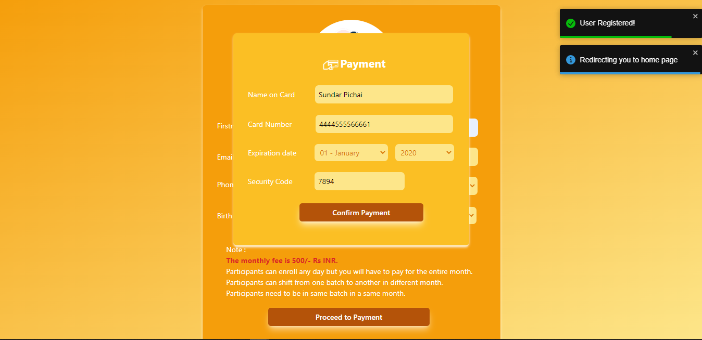
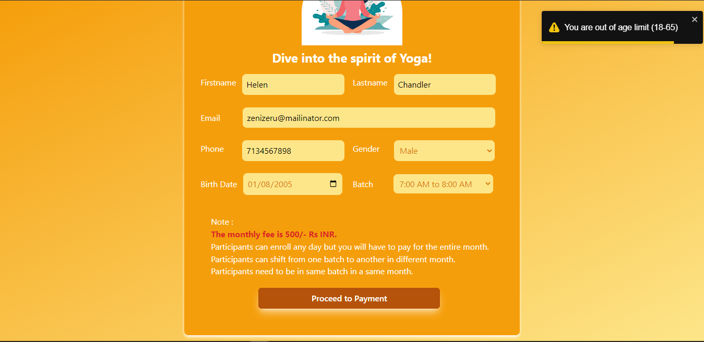
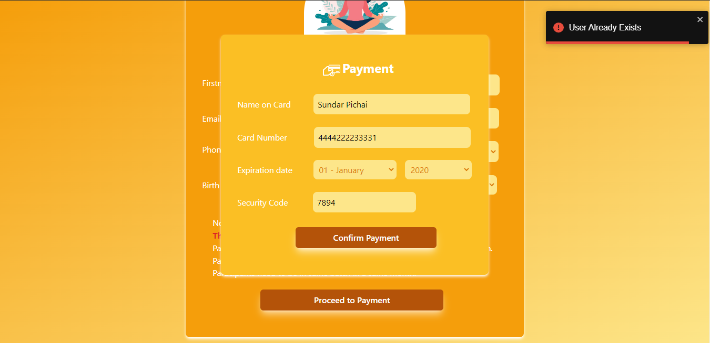

# Yoga Form

An admission form for the Yoga Classes which happen every month.
## Installation

Make sure you have [npm](https://www.npmjs.com/package/npx) installed.

Run the following command in the frontend folder

```sh
npm install
npm start
```

Run the following command in the backend folder

```sh
npm install
node server.js
```

# Tech Stack Used

- MongoDB
- Express.js
- React.js
- Node.js
- Tailwind CSS


## Demo

Visit this site at : https://yoga-class-form.netlify.app/

- Visit the site
  

- Fill the information
  

- Click on *Proceed to Payment* button.
  If user is successfully registered it will show a sucess message and user will be redirected to homepage.
  

- If user's age is less than 18 or greater than 65 the website will show a warning.
  And user won't be allowed to proceed for payment.
  

- If user is trying to register with same email second time website will show error message.
  

# ER Diagram
<p align="center">
  
</p>

    